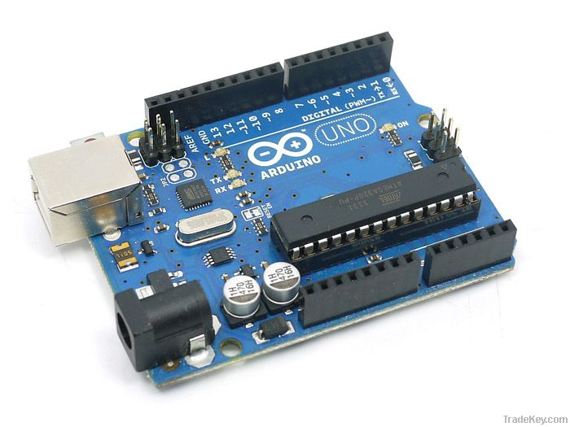
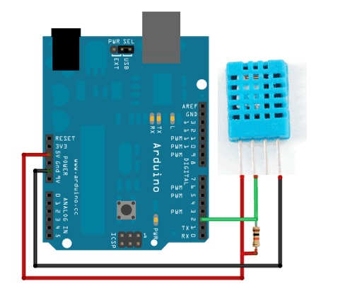
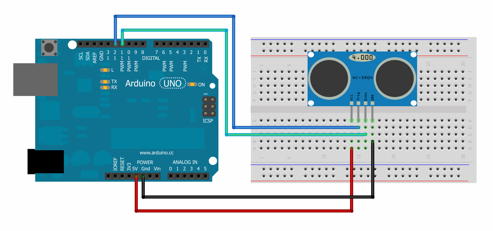

# Demo Projects of Mini SCADA 

Arduino, DHT11, HC-SR04  

Python, PyQt, PySerial, PyQwt, Thread, Tornado

Websocket

## PyQtArduinoSerialDemo

A threaded GUI example with Python and Qt/PyQt 

This simple example display information from the Arduino and DHT11. 

Reference:  http://blog.wickeddevice.com/?p=191 

## PyQtArduinoDHT11

A threaded GUI example with Python and Qt/PyQt 

A serial port packet monitor that plots live data using PyQwt

Reference:  https://github.com/mba7/SerialPort-RealTime-Data-Plotter

## TornadoArduinoDHT11

Tornado web server on PC which listens for serial communication from Arduino 

## PyQtArduinoUltrasonic

Ultrasonic: A threaded GUI example with Python and Qt/PyQt 

Reference:  https://github.com/mba7/SerialPort-RealTime-Data-Plotter

## Reference

1. Arduino: http://www.arduino.cc/

2. Arduino and Python: http://playground.arduino.cc/Interfacing/Python

3. PyQt: https://riverbankcomputing.com/software/pyqt/intro

4. Tornado Web Server: http://www.tornadoweb.org/en/stable/

5. Noah Gift. Practical threaded programming with Python 

http://www.ibm.com/developerworks/aix/library/au-threadingpython/index.html

## License

MIT 
